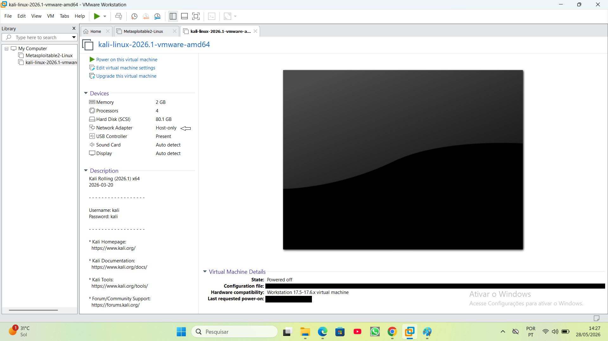
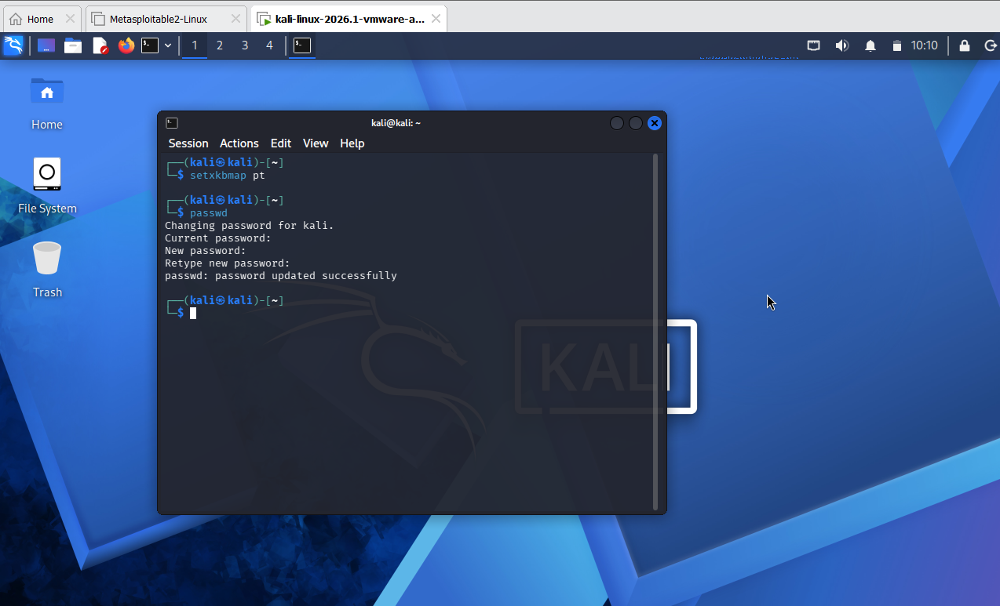

# Projeto de Hardening (CIS Control 4)

Projeto prático de auditoria e fortalecimento de sistema Linux baseado nas salvaguardas do controlo CIS 4.

## 🌐 Isolamento de Rede Perimetral (CIS 4.2)

Para garantir a total segurança do sistema anfitrião (host) e da rede local residencial (como o router doméstico, computadores e televisões), o laboratório foi configurado estritamente em modo **Host-only** (Placa de rede exclusiva do hospedeiro).

### Por que razão o modo Host-only é o mais seguro?
* **Isolamento Total:** Cria uma rede virtual fechada onde apenas as máquinas virtuais comunicam entre si.
* **Sem Rota Lateral:** Bloqueia completamente o acesso à Internet. Isso impede que qualquer malware ou ataque interaja com dispositivos reais da sua rede local.
* **Controlo de Tráfego:** Mitiga o risco de fugas de dados ou tráfego malicioso para fora do ambiente de testes.

*(Nota: Caminhos de diretórios locais foram ofuscados por motivos de privacidade e segurança dos dados).*

---

## 🔑 Fase 2: Gestão de Contas e Credenciais (CIS Control 4.7)

De acordo com a salvaguarda **CIS Control 4.7 (Manage Default Accounts)**, manter credenciais padrão de fábrica em sistemas operativos ativos representa um risco crítico de segurança, pois facilita o acesso inicial não autorizado por parte de atacantes.

### Mitigação Prática Aplicada
Após garantir o isolamento perimetral da rede virtual, foi efetuado o *hardening* (endurecimento) interno do sistema operativo do atacante (Kali Linux) através da revogação imediata das credenciais padrão de instalação (`kali:kali`).

* **Ação:** Utilização do comando `passwd` para a criação de uma nova palavra-passe robusta e exclusiva para o utilizador do sistema.

*(Nota: O print demonstra a confirmação do sistema operativo após a atualização bem-sucedida das credenciais de segurança).*

## Fase 3: Conectividade de Rede.
# Análise de Conectividade de Rede com ICMP (Ping)

Testes de conectividade de rede local utilizando o protocolo ICMP através do comando `ping` num ambiente Linux.

## Diagnóstico de Rede

A imagem abaixo ilustra um teste de eco (*Echo Request/Reply*) bem-sucedido direcionado ao endereço IP `192.xxx.xxx.xxx`:

---

## Resumo Técnico do Estudo

O teste foi executado com sucesso e apresenta estabilidade total na comunicação entre os dispositivos da rede local. Abaixo estão as principais conclusões métricas extraídas da análise:

### 1. Desempenho e Latência (RTT)
* **O que é Latência?**
  É um tempo de atraso que o dado leva para viajar do ponto de origem até o destino. No caso do comando `ping´ medimos o RTT(Round-Trip time) que é o tempo total de ida e volta.
* **Tempo Mínimo (`min`):** 0.839 ms (alta velocidade de resposta).
* **Tempo Máximo (`max`):** 7.251 ms (ocorrido apenas no primeiro pacote devido à resolução ARP inicial).
?? Por que esse tempo de latência tão grande no primeiro pacote?
por causa da ARP(`PROTOCOLO DE RESOLUÇÃO DE ENDEREÇO´).

* **ARP Resquest** faz a pergunta(EM BROADCAST): Quem tem o IP XXX.XXX.XXX.XXX?
* ** ARP REPLY(em unicast) a maquina reconhece seu proprio IP e responde com seu endereço fisico(MAC)

* **Tempo Médio (`avg`):** 2.617 ms.
* **Instabilidade da Rede (`mdev`):** 2.679 ms. O desvio médio baixo confirma que a ligação é estável e livre de oscilações severas (*jitter*).
* **obs:** esses testes sao feitos em uma laboratorio domestico pessoal.
e altera quando se trata de  uma estrutura empresarial.
### 2. Integridade dos Dados
* **Pacotes Transmitidos:** 4
* **Pacotes Recebidos:** 4
* **Perda de Pacotes (`packet loss`):** 0% (comunicação limpa, sem descartes).

### 3. Topologia da Rede
* **O que é mapeamento de salto?**
  É o processo de **descobrir e listar** cada roteador intermediario (cada roteador um salto.)
* **Mapeamento de Saltos:** O valor de **`TTL=64`** permaneceu intacto na resposta. Isto comprova tecnicamente que o dispositivo de destino está localizado no mesmo segmento da **rede local (LAN)**, sem a necessidade de atravessar *roteadores* intermédios.

